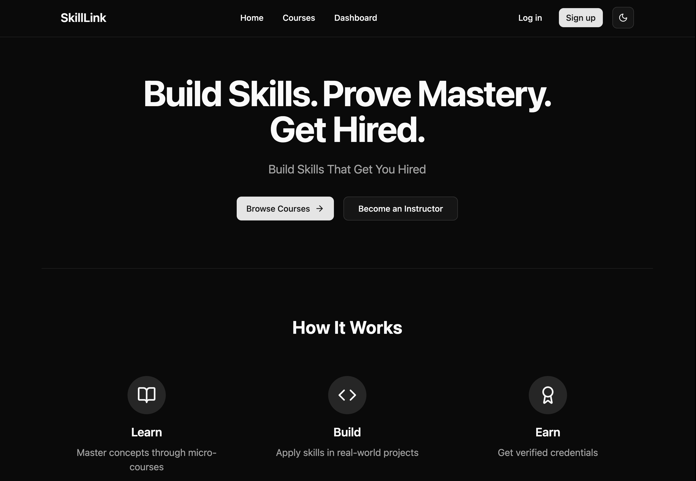
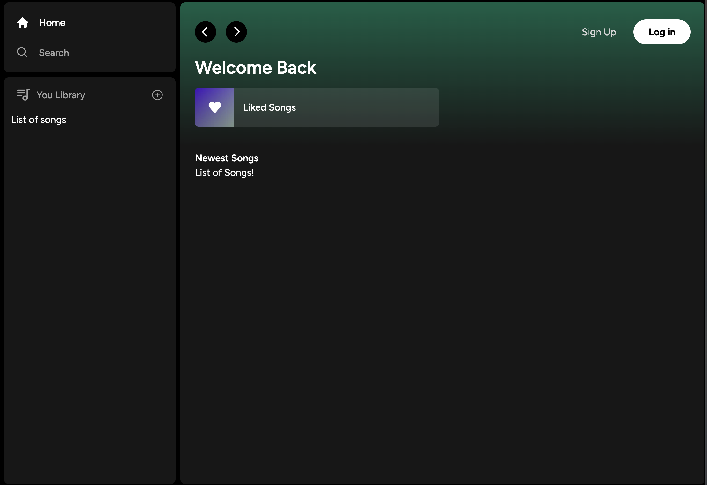

# Portfolio Website

This is a portfolio website built using [Next.js 15](https://nextjs.org/), [TypeScript](https://www.typescriptlang.org/), and [TailwindCSS](https://tailwindcss.com/). The site is designed to be responsive, accessible, and visually polished, featuring a custom dark-themed grid background and optimized production settings. It is deployed using modern deployment practices.

## Features

- **Hero Section**: Displays name, title, and location.
- **Resume Download**: Provides a link to download the resume.
- **Social Media Links**: Includes LinkedIn, GitHub, and Twitter/X.
- **Tabbed Content**: Custom components for Work Experience and Education.
- **Technical Skills**: Styled tags showcasing technical skills.
- **Projects Section**: Highlights two detailed projects:
    - **Skill Learn**: A micro-course platform.
    - **TuneSync**: A real-time music analytics platform.
- **Responsive Design**: Fully optimized for all devices.
- **Custom Dark-Themed Background**: A visually appealing grid design.

---

## Projects

### 1. Skill Learn
**Description**: A micro-course platform enabling users to learn new skills through short, focused courses.

**Demo Screenshot**:  


**Features**:
- User authentication and profile management.
- Course creation and enrollment.
- Real-time progress tracking.

**Technologies Used**:
- Kafka
- Spark
- AWS
- Docker
- Spring Boot
- TailwindCSS
- Framer Motion

---

### 2. TuneSync
**Description**: A real-time music analytics platform providing insights into music trends and user preferences.

**Demo Screenshot**:  


**Features**:
- Real-time data visualization.
- Integration with music streaming APIs.
- Advanced analytics dashboard.

**Technologies Used**:
- Kafka
- Spark
- AWS
- Docker
- Spring Boot
- TailwindCSS
- Framer Motion

---

## Getting Started

To run the project locally, follow these steps:

1. Clone the repository:
     ```bash
     git clone https://github.com/your-username/portfolio.git
     cd portfolio
     ```

2. Install dependencies:
     ```bash
     npm install
     ```

3. Run the development server:
     ```bash
     npm run dev
     ```

4. Open [http://localhost:3000](http://localhost:3000) in your browser to view the site.

---

## Deployment

This portfolio is deployed using [Vercel](https://vercel.com/). For more details on deploying Next.js applications, refer to the [Next.js deployment documentation](https://nextjs.org/docs/app/building-your-application/deploying).

---

## License

This project is licensed under the [MIT License](LICENSE).

Feel free to customize and use this portfolio as a template for your own projects! 